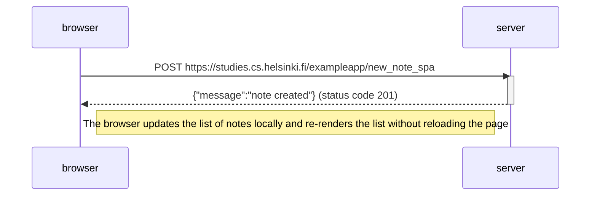

```mermaid
sequenceDiagram
    participant browser
    participant server
    browser->>server: POST https://studies.cs.helsinki.fi/exampleapp/new_note_spa
    activate server
    server-->>browser: {"message":"note created"} (status code 201)
    deactivate server
    Note right of browser: The browser updates the list of notes locally and re-renders the list without reloading the page
```
